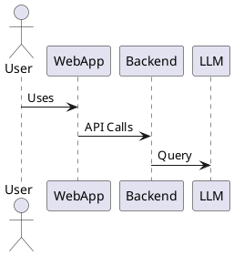

# Example RFC Template for Tesfa

## Title: [Short, Descriptive Title]

**Status:** Proposed | Accepted | Rejected | Deprecated
**Author:** [Your Name]
**Created:** [YYYY-MM-DD]
**Updated:** [YYYY-MM-DD]

---

## 1. Overview
A short summary of the problem, context, and the proposed solution.

## 2. Motivation
Why is this change needed? What problems does it solve?

## 3. Detailed Design
- Architecture diagrams (see below for PlantUML example)
- API changes
- Data model changes
- Security, performance, and other considerations

## 4. Alternatives Considered
Briefly describe other options and why they were not chosen.

## 5. Impact
- Migration plan
- Backward compatibility
- Risks

## 6. Open Questions
List any unresolved issues or questions.

---

## Example PlantUML Diagram

---

## References
- [Link to related issues, docs, or RFCs]
