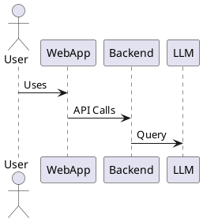

# Example RFC Template for Tesfa

## Title: [Short, Descriptive Title]

**Status:** Proposed | Accepted | Rejected | Deprecated
**Author:** [Your Name]
**Created:** [YYYY-MM-DD]
**Updated:** [YYYY-MM-DD]

---

## 1. Overview
A short summary of the problem, context, and the proposed solution.

## 2. Motivation
Why is this change needed? What problems does it solve?

## 3. Detailed Design
- Architecture diagrams (see below for PlantUML example)
- API changes
- Data model changes
- Security, performance, and other considerations

## 4. Alternatives Considered
Briefly describe other options and why they were not chosen.

## 5. Impact
- Migration plan
- Backward compatibility
- Risks

## 6. Open Questions
List any unresolved issues or questions.

---

## Example PlantUML Diagram

---

## References
- [Link to related issues, docs, or RFCs]

# Tesfa Product Management AI Workflow

1. **Set Product Context**
   - Define your product, target users, and goals.
   - Example: “Tesfa is a collaborative platform for LLM-powered agentic workflows.”

2. **Feature Ideation**
   - Prompt: “Generate 5 new features to improve agent collaboration in Tesfa.”
   - Use LLMs to suggest features relevant to your platform.

3. **Requirements & User Stories**
   - Prompt: “Write user stories for a ‘multi-agent chat’ feature in Tesfa.”
   - AI drafts actionable stories for your dev team.

4. **Technical RFC Drafting**
   - Prompt: “Draft an RFC for integrating Drafahan as a new LLM provider in Tesfa.”
   - AI helps structure and fill out RFCs, including diagrams.

5. **Roadmap Planning**
   - Prompt: “Prioritize these features for Q4 2025 based on user impact and technical effort.”
   - AI sequences features and suggests milestones.

6. **Feedback Analysis**
   - Prompt: “Summarize feedback from Tesfa beta users about agent switching.”
   - AI clusters feedback and highlights pain points.

7. **Test Case Generation**
   - Prompt: “Generate integration test cases for the agent selection UI.”
   - AI creates test scenarios for your frontend and backend.

8. **Release Notes**
   - Prompt: “Write release notes for Tesfa v1.2, focusing on new agentic features.”
   - AI drafts clear, user-focused notes.

---

# AI Prompt Template for Tesfa Product Management

**Task:**  
Clearly state what you want the AI to do.  
*Example:* Generate user stories for a new multi-agent chat feature.

**Context:**  
Provide background, relevant details, and any specific information about your product, users, or environment.  
*Example:* Tesfa is a collaborative platform for LLM-powered agentic workflows. The new feature will allow users to switch between multiple AI agents in a chat interface.

**Role:**  
Specify the persona or expertise you want the AI to adopt.  
*Example:* Act as a senior product manager with experience in SaaS and AI integrations.

**Format:**  
Describe the desired output format (list, table, markdown, code, etc.).  
*Example:* Output as a numbered list of user stories in markdown.

**Examples:**  
Provide sample inputs/outputs to guide the AI.  
*Example:*  
_Input:_ User wants to switch agents during a chat.  
_Output:_ As a user, I want to switch between agents in a chat so I can get different perspectives.

**Tone:**  
Set the style (formal, friendly, concise, technical, etc.).  
*Example:* Use a clear, professional, and concise tone.

**Constraints:**  
List any limitations, requirements, or boundaries.  
*Example:* Limit to 5 user stories. Focus on agent switching, not chat UI design.

---

**Full Example Prompt:**
> Task: Generate user stories for a new multi-agent chat feature.  
> Context: Tesfa is a collaborative platform for LLM-powered agentic workflows. The new feature will allow users to switch between multiple AI agents in a chat interface.  
> Role: Act as a senior product manager with experience in SaaS and AI integrations.  
> Format: Output as a numbered list of user stories in markdown.  
> Examples:  
> - Input: User wants to switch agents during a chat.  
> - Output: As a user, I want to switch between agents in a chat so I can get different perspectives.  
> Tone: Use a clear, professional, and concise tone.  
> Constraints: Limit to 5 user stories. Focus on agent switching, not chat UI design.

---

**How to Use:**
- Integrate these prompts and flows into your Tesfa UI.
- Let users select context (feature, agent, provider) before running AI workflows.
- Track and store outputs for team review and iteration.
